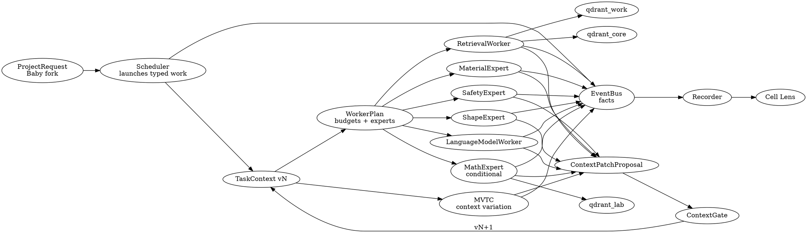

# Example — Baby Fork Project in the Next Architecture

Project request:

```text
Create a project to design a fork adapted for babies.
```

The system must keep the context away from unrelated domains such as aerospace antenna design.

## Classification

```text
domain: baby utensil
contact: food
zones: design, material, safety, manufacturing, audit
excluded drift: weapon, aerospace, antenna, sharp tool
```

## Initial TaskContext

```text
TaskContext v1
  objective: baby fork
  constraints:
    non-toxic
    food contact
    easy to clean
    rounded geometry
    anti-choking dimensions
    baby grip
  budgets:
    search_passes: moderate
    context_patches: limited
    math_expert: conditional
    MVTC: enabled
```

## Workers

```text
RetrievalWorker      → qdrant_core / qdrant_work
MaterialExpert       → silicone, food-grade plastic, rounded stainless steel
ShapeExpert          → teeth shape, radius, handle, anti-choking guard
SafetyExpert         → toxicity, sharpness, choking, breakage, hygiene
ManufacturingExpert  → molding, injection, cleaning, durability, cost
MathExpert           → conditional geometry / optimization
LanguageModelWorker  → constraint extraction and findings, no command authority
```

## Qdrant filters first

```text
domain=baby_utensil
food_contact=true
age_target=baby
hazard_class=low
```

Then selected vector spaces:

```text
semantic_vector
material_vector
geometry_vector
safety_vector
manufacturing_vector
```

## MVTC

MVTC creates and compares context variants:

```text
variant A: soft silicone fork
variant B: rounded stainless steel with soft handle
variant C: bioplastic fork
variant D: spoon-fork hybrid
variant E: fork with anti-choking guard
```

MVTC outputs ContextPatchProposal, SearchAxisScore, ExpertNeed, BudgetAdvice, and RiskSignal. It does not command the Scheduler.

## DOT view


