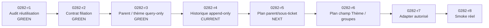
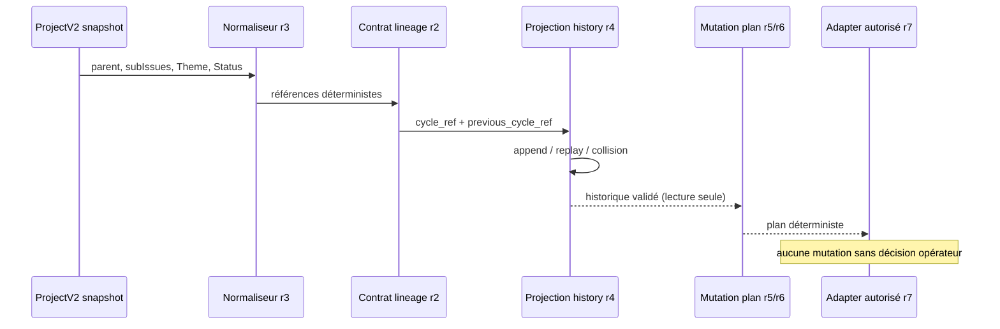

# Schéma du développement en cours — ProjectV2 cycle history 0282

## Flux fonctionnel visé

## Invariants r4

- un seul `root_issue_ref` par historique ;
- ordres de cycles contigus ;
- `previous_cycle_ref` pointe vers le dernier cycle ;
- replay identique accepté sans ajout ;
- même cycle avec contenu différent = collision ;
- digest d'entrée et digest global vérifiés ;
- aucune écriture GitHub, SQL, Qdrant ou fichier ;
- aucune modification du Scheduler.
