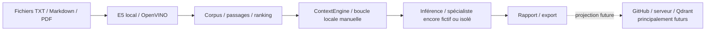
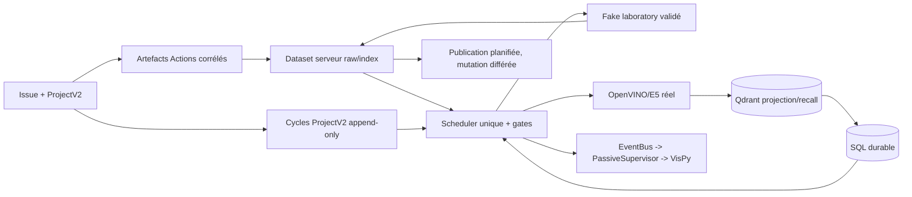

# Comparaison — orientation du début et architecture actuelle

Cette comparaison reconstitue l'orientation initiale à partir des documents
historiques Phase 3.x et du graphe patrimonial `00_global.dot`. Elle ne prétend
pas qu'un unique schéma initial ait été exécutable tel quel.

## Vers le début du projet — orientation reconstituée



## Architecture actuelle — 0282-r4



## Comparatif

| Dimension | Début du projet | État actuel 0282-r4 |
|---|---|---|
| Centre de gravité | pipeline local E5 et contexte manuel | boucle orchestrée, durable et observable |
| Orchestration | scripts/CLI et contrats en construction | Scheduler unique, gates et handlers existants |
| Connaissance durable | corpus/fichiers et persistance locale en évolution | SQL autorité durable, réhydratation par `sql_ref` |
| Vecteurs | E5 local puis Qdrant envisagé | OpenVINO/E5 explicite, Qdrant projection/recall |
| GitHub | projection et serveur futurs | ProjectV2 query-only, Actions, fetch réel, dataset, plans contrôlés |
| Laboratoires | idée de spécialistes / inférence | fake lab fermé validé, portabilité future contractualisée |
| Historique | rapports et révisions locales | cycles ProjectV2 append-only, replay/collision déterministes |
| Observation | télémétrie minimale | EventBus, PassiveSupervisor, DOT, VisPy/Cell Lens |
| Publication | export local | preview/plan idempotent, mutation distante encore gatée |
| Déploiement | développement local | Gentoo/OpenRC, services externes hors Scheduler |

## Ce qui n'a pas changé

```text
- recherche locale contrôlable et vérifiable ;
- séparation entre connaissance, modèle et orchestration ;
- volonté de rendre les artefacts compréhensibles et rejouables ;
- progression par contrats déterministes avant les effets réels ;
- objectif final d'un système capable d'accompagner un projet concret.
```

## Ce qui a profondément changé

Le projet n'est plus seulement une chaîne documentaire/E5. Il est devenu une
architecture de contexte et de travail : GitHub sert d'interface, SQL conserve
l'autorité, Qdrant rappelle, le Scheduler orchestre, les laboratoires exécutent,
et les vues passives rendent le système inspectable. Chalouf reste le scénario
intégrateur final plutôt qu'un composant du noyau.
